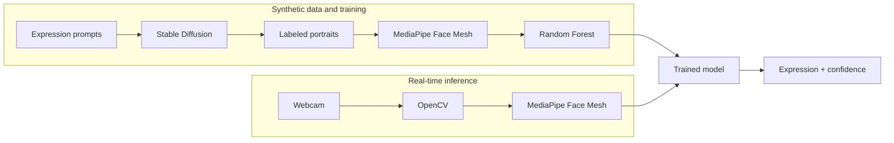

# ExpressionMesh

[](https://github.com/matemink/ExpressionMesh/actions/workflows/ci.yml)
[](https://www.python.org/)

ExpressionMesh is an end-to-end computer-vision project that connects
synthetic dataset generation, model training, and real-time webcam inference.
It generates labeled portraits with Stable Diffusion, extracts normalized
MediaPipe Face Mesh landmarks, trains a scikit-learn classifier, and runs the
result locally through OpenCV.

This is an engineering experiment, not a claim that facial expressions reveal
a person's internal emotional state. Provenance and limitations are documented
in the [model card](MODEL_CARD.md).

## Pipeline



## Run webcam inference

Create a Python 3.10-3.12 environment and install the vision dependencies:

```bash
python -m venv .venv
source .venv/bin/activate          # Windows: .venv\Scripts\activate
python -m pip install -e ".[vision]"
expression-mesh-model-info model
expression-mesh-webcam --model model --camera 0
```

Press `q` to exit. Only load pickle artifacts you trust.

## Reproduce training

Provide `happy`, `sad`, and `surprised` image directories, then run:

```bash
expression-mesh-prepare-data path/to/faces --output data.txt
expression-mesh-train data.txt --model artifacts/model.pkl --metrics artifacts/metrics.json
```

Synthetic portraits can be regenerated after installing `.[generation]`:

```bash
python tools/generate_synthetic_faces.py path/to/faces --per-class 250 --seed 42
```

The dataset is intentionally not tracked because of its size and upstream
model licensing. Training is seeded and emits machine-readable metrics.

## Quality and limitations

```bash
python -m pip install -e ".[dev]"
ruff check .
pytest
```

GitHub Actions runs linting and unit tests on Python 3.10 and 3.12. The
committed legacy model was trained on synthetic images; its original dataset
and evaluation metrics are unavailable, so no accuracy is claimed. It requires
scikit-learn `1.4.1.post1` for reliable pickle compatibility. Webcam behavior
and real-world generalization remain manual validation areas.
