# ExpressionMesh

ExpressionMesh is an end-to-end computer-vision project covering synthetic
dataset generation, model training, and real-time webcam inference. Stable
Diffusion creates labeled portraits; MediaPipe, scikit-learn, and OpenCV turn
them into a locally executable expression classifier.

This is an engineering experiment, not a claim that facial expressions reveal
a person's internal emotional state.

## Pipeline

<a href="https://matemink.github.io/ExpressionMesh/">
  <picture>
    <source media="(prefers-color-scheme: dark)" srcset="docs/diagrams/overview-dark.svg">
    
  </picture>
</a>

[Explore the interactive map](https://matemink.github.io/ExpressionMesh/) · [Diagram source and refresh guide](docs/diagrams/README.md)

## Highlights

- Synthetic portrait generation with seeded Stable Diffusion prompts.
- Shared MediaPipe Face Mesh feature extraction for training and inference.
- Deterministic Random Forest training with machine-readable metrics.
- Local real-time webcam classification through OpenCV.
- Model-contract validation plus linting and unit tests in GitHub Actions.

## Built and tested with

- **Generation:** Stable Diffusion, Hugging Face Diffusers, and PyTorch.
- **Vision and ML:** MediaPipe Face Mesh, OpenCV, and scikit-learn.
- **Quality:** Ruff and pytest on Python 3.10 and 3.12 in GitHub Actions.

The committed legacy model was trained on synthetic images. Its original
dataset and evaluation metrics are unavailable, so no accuracy is claimed;
webcam behavior and real-world generalization remain manual validation areas.

## Explore

- [Model provenance and limitations](MODEL_CARD.md)
- [Application code](src/expression_mesh)
- [Tests](tests)
